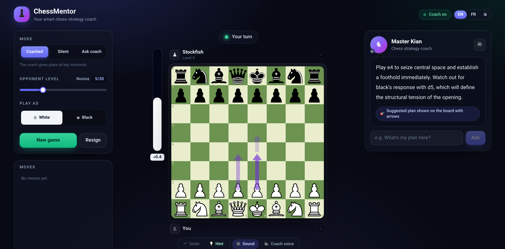

# ChessMentor ♟️ — Master Kian / استاد کیان

A web app where you play live chess against a bot while an AI coach — **Master
Kian** — teaches you *strategy and planning* in real time. Not just
"good move / bad move", but **why**, and **what the long-term plan should be**.

The UI and coaching come in **English / Français / فارسی** (with automatic RTL for Persian);
the code and comments are in English.



- **Instant, engine-only feedback** on every move: an animated eval bar and move-quality
  badges (✨ Brilliant / 👍 Good / ⚠️ Inaccuracy / ❗ Mistake / 💥 Blunder).
- **Concise strategic coaching at key moments** — a short, to-the-point plan (LLM-powered,
  streamed into Master Kian's speech bubble) with **plan arrows** drawn on the board.
- **Tactical threat warnings** — a null-move scan detects what the opponent threatens and shows
  a **red arrow**, an endangered-square glow, and a *"Careful — I can win your knight!"* banner.
- **Ask the coach** any question about the position on demand.
- **Human-like opponent** — adjustable Stockfish Skill Level (0–20) with a natural "thinking"
  pause before it replies, plus an adaptive difficulty suggestion.
- **Nice to play** — click-to-move *and* drag, legal-move hint dots, take back a move, a
  best-move **hint arrow**, and captured-piece trays showing each side's losses + material lead.
- **Sounds & coach voice** — synthesized move/capture/check sounds (Web Audio) and an optional
  spoken coach voice (Web Speech API, all three languages). Toggleable in the board toolbar.
- **Session summary** with an accuracy ring, a move-quality breakdown, and an encouraging takeaway.
- **Trilingual UI** via a header toggle; the coach also replies in the selected language, and the
  choice is remembered across sessions.

---

## Tech stack

| Layer | Choice |
|---|---|
| Frontend | React 18 + Vite + TailwindCSS |
| Chess rules | [`chess.js`](https://github.com/jhlywa/chess.js) |
| Board UI | [`react-chessboard`](https://github.com/Clariity/react-chessboard) (v4) |
| Chess engine | [`stockfish`](https://github.com/nmrugg/stockfish.js) 18 (lite, single-threaded WASM) in a Web Worker, with `MultiPV` |
| State | Zustand |
| Backend | Node + Express, `POST /api/coach` (streaming) |
| Coach LLM | Anthropic Claude (`claude-sonnet-4-6`) **or** any local OpenAI-compatible server (LM Studio) |

The Stockfish build is the **lite single-threaded** flavor on purpose: it needs no
`SharedArrayBuffer` and therefore no COOP/COEP cross-origin-isolation headers, so it
"just works" behind the Vite dev server.

---

## Prerequisites

- **Node.js ≥ 18** (developed on Node 23). `npm` comes with it.
- A coach backend provider — pick one:
  - an **Anthropic API key** ([console.anthropic.com](https://console.anthropic.com/)), or
  - a **local LLM** exposing an OpenAI-compatible API (e.g. [LM Studio](https://lmstudio.ai/)).
- The game itself (board, engine, eval bar, move badges) works **with no provider at all** —
  only the natural-language coaching needs one.

---

## Setup

```bash
# 1) Install all dependencies (root + client + server).
#    This also copies the Stockfish WASM into client/public/stockfish/.
npm run install:all

# 2) Configure the coach backend (see "Coach providers" below).
cp .env.example server/.env
#    then edit server/.env

# 3) Run both the frontend and backend together.
npm run dev
```

Then open **http://localhost:5173**. The Vite dev server proxies `/api/*` to the
Express backend on port 3001, so there is no CORS to configure.

> If `client/public/stockfish/` is empty (e.g. you cloned without installing), run
> `npm run setup:stockfish` to copy the engine out of `node_modules`.

---

## Coach providers

Selection order (first match wins), all via `server/.env`:

1. `COACH_PROVIDER` set explicitly (`anthropic` | `local`)
2. `ANTHROPIC_API_KEY` present → **anthropic**
3. `OPENAI_BASE_URL` present → **local**
4. otherwise the coach is **offline** (game still fully playable)

### Option A — Anthropic Claude (production)

```dotenv
# server/.env
ANTHROPIC_API_KEY=sk-ant-...
COACH_MODEL=claude-sonnet-4-6
```

The key is only ever read from the environment — it is never hardcoded and never sent
to the browser.

### Option B — Local LLM via LM Studio (testing)

Start your model in LM Studio's local server, then:

```dotenv
# server/.env
COACH_PROVIDER=local
OPENAI_BASE_URL=http://127.0.0.1:5004/v1
OPENAI_API_KEY=lm-studio
LOCAL_MODEL=gemma4-12b-qat-uncensored-hauhaucs-balanced
# LOCAL_MAX_TOKENS=1500   # give reasoning models room to finish thinking + answer
```

`OPENAI_BASE_URL` should point at the OpenAI-compatible base (LM Studio serves it under
`/v1`). The backend streams the model's SSE output straight through to the speech bubble.
**Reasoning models are supported**: their internal "thinking" is streamed live (shown dimmed)
and then replaced by the clean answer — raise `LOCAL_MAX_TOKENS` if replies get cut off.

Check which provider is live at any time:

```bash
curl http://localhost:3001/api/health
# { "ok": true, "provider": "...", "model": "...", "coachEnabled": true }
```

---

## How to play

1. Pick your language (EN / FR / فا, top-right), your color, and the opponent's **Skill Level
   (0–20)**, then press **New game**.
2. **Click-to-move or drag** a piece — legal targets are shown as dots. Every move gets an
   instant quality badge and updates the eval bar.
3. In **Coached** mode, Master Kian gives a short plan at strategic turning points (with plan
   arrows) and warns you with a **red arrow + banner** when the opponent has a real threat.
4. Use the board toolbar to **take back** a move, get a **hint** arrow, or toggle **sound** and
   the **coach voice**. Type in the coach box any time to **ask** a question.
5. At game end you get a **session summary** and, if warranted, a difficulty suggestion.

### Interaction modes

| Mode | Behaviour |
|---|---|
| Coached (default) | Auto plans + threat warnings at key moments **+** on-demand questions |
| Silent | Only the eval bar and move-quality badges — no coaching or warnings |
| Ask | No auto-coaching; ask questions on demand |

---

## Tuning the coach

**Personality / tone** — edit the system prompt in
[`server/coachPrompt.js`](server/coachPrompt.js) (`COACH_SYSTEM_PROMPT`). The user-message
builder in the same file controls exactly what position data is handed to the model.

**Coaching frequency** — edit `DEFAULT_TRIGGER_CONFIG` in
[`client/src/analysis/coachTrigger.js`](client/src/analysis/coachTrigger.js):

```js
export const DEFAULT_TRIGGER_CONFIG = {
  minGapPlies: 6,           // never coach more often than every ~3 full moves
  maxGapPlies: 10,          // always coach at least every ~5 full moves
  turningPointGapPlies: 3,  // anti-spam guard before a turning-point trigger
  evalSwingCp: 150,         // centipawn swing that counts as a turning point
};
```

Turning points also include: the opening ending, a major-piece (rook/queen) trade, and a
pawn-structure change.

**Engine strength / analysis depth / threat sensitivity / think time** — see the constants at
the top of [`client/src/store/gameStore.js`](client/src/store/gameStore.js): `EVAL_DEPTH`,
`COACH_DEPTH`, `COACH_MULTIPV`, `THREAT_DEPTH`, and `THREAT_CP` (the centipawn swing that counts
as a threat). The opponent's human-like pause lives in the `engineThinkMs()` helper in the same
file. Analysis for the eval bar and move quality always runs at full engine strength (Skill 20)
regardless of the opponent's level, so feedback stays honest.

---

## How it works

```
                 ┌─────────────────────────── browser (React) ───────────────────────────┐
   drag a move → │ chess.js (rules)                                                        │
                 │        │                                                                │
                 │        ▼                                                                │
                 │  Stockfish Web Worker (UCI, MultiPV)  ── eval + best lines ──►  eval bar│
                 │        │                                       │                        │
                 │        ├── before/after eval ──► move-quality classifier ──► toast badge│
                 │        │                                                                │
                 │        ├── null-move scan ──► threat? ──► red arrow + "Careful!" banner   │
                 │        │                                                                │
                 │        └── coachTrigger? ──► positionFeatures (FEN → strategic JSON)    │
                 │                                        │                                │
                 └────────────────────────────────────── │ ───────────────────────────────┘
                                                          ▼   POST /api/coach (features + engine lines)
                                        ┌──────────── Express backend ────────────┐
                                        │  provider = Claude  |  local LM Studio   │
                                        └──────────────────── │ ───────────────────┘
                                                    ▼  streamed coaching text (chosen language)
                                                    Master Kian speech bubble + plan arrows
```

Key ideas:

- **The model never sees the board.** The [position feature
  extractor](client/src/analysis/positionFeatures.js) turns the FEN into structured JSON
  (pawn structure, open files, king safety, piece activity, material imbalances, space,
  game phase). *That* — plus Stockfish's evaluation lines — is what Claude reasons about.
- **Move quality is engine-only and instant.** It uses a Lichess-style win-probability model
  so a 200cp slip near equality is a blunder while the same slip when already winning is not
  (see [`moveQuality.js`](client/src/analysis/moveQuality.js)).
- **Plan arrows are the engine's own principal variation**, so they are inherently
  tactically validated — the arrows *are* the engine's chosen continuation.
- **Threat warnings use a "null move" scan.** On your turn the app hands the move to the
  opponent (a null move) and analyses that; if their best free move swings the eval by
  ≥ ~2 pawns (or threatens mate), it flags the threat with a red arrow + banner.
- **The opponent pauses like a human** before replying — a jittered delay (a bit longer in
  tense positions) so its move is easy to follow instead of appearing instantly.

---

## Project structure

```
.
├── package.json              # root: `npm run dev` runs client + server together
├── scripts/copy-stockfish.js # copies the WASM engine into client/public/
├── server/
│   ├── index.js              # Express app + streaming /api/coach
│   ├── providers.js          # Anthropic | local (OpenAI-compatible) provider abstraction
│   └── coachPrompt.js        # coach persona + prompt builder  (tune personality here)
└── client/
    └── src/
        ├── engine/           # Stockfish worker wrapper + UCI parsing
        ├── analysis/         # moveQuality, positionFeatures, coachTrigger
        ├── store/gameStore.js# Zustand store — orchestrates the whole game loop
        ├── api/coach.js      # streaming fetch client
        ├── lib/              # i18n (en/fr/fa), chess helpers, sound, speech (TTS)
        └── components/       # Board, EvalBar, CoachPanel, MoveToasts, BoardToolbar,
                              #   ThreatBanner, CapturedPieces, LanguageToggle, SessionSummary, ...
```

---

## Scripts

| Command | What it does |
|---|---|
| `npm run dev` | Start backend (3001) and frontend (5173) together |
| `npm run build` | Production build of the client |
| `npm run start` | Run only the backend |
| `npm run install:all` | Install root + client + server deps |
| `npm run setup:stockfish` | (Re)copy the Stockfish engine into `client/public/stockfish/` |

---

## Notes & limitations

- Pawn promotions auto-queen (the most common case).
- "Backward pawn" / "bad bishop" / "outpost" detection uses pragmatic heuristics — good
  enough to give the coach concrete features to talk about, not a formal evaluation.
- The coach voice uses the browser's built-in speech synthesis, so available voices (and
  Persian quality in particular) depend on your OS. English/French are widely available.
- The Stockfish WASM (~7 MB) is git-ignored and regenerated from `node_modules` on install.
